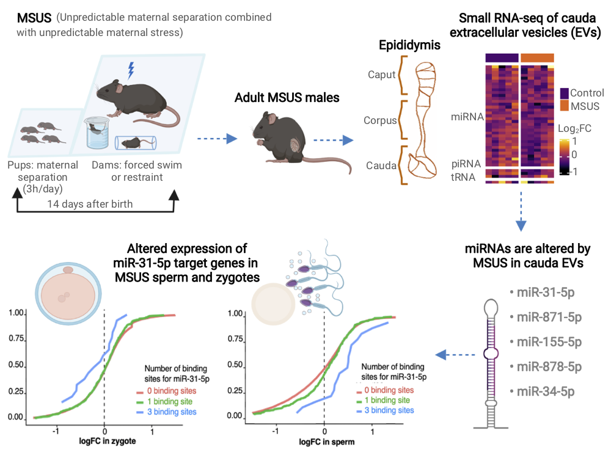

# Files

## [Cauda EVs small RNA-seq analysis (only 1 run - non size-selected)](file1_first_sequencing_runs_DEA_all_biotypes.html)

## [Cauda EVs miRNAs analysis using data from both runs](file2_2sequencing_runs_DEA_miRNAs_only.html)

## [Cauda EVs tRNAs analysis using data from both runs](file3_2sequencing_runs_DEA_tRNAs_only.html)

## [Cauda EVs small RNA-seq analysis using data from both runs (all biotypes combined)](file4_2sequencing_runs_DEA_all_biotypes_inlcuding_rRNAs.html)

## [Cauda EVs rRNAs analysis using data from both runs](file5_2sequencing_runs_DEA_rRNAs_only.html)

## [CD-plot supplementary info](miRNAs (1).html)

## [Genes table used for CD plot](cd_plot.html)